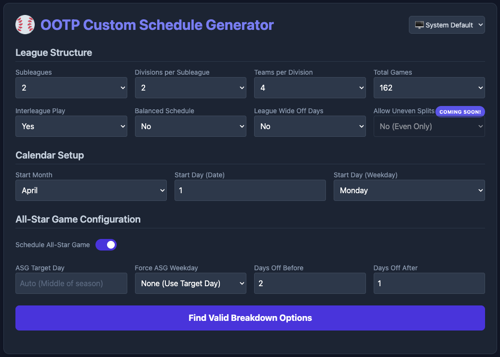
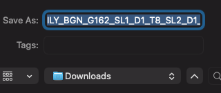

# ⚾️ OOTP Custom Schedule Generator

Build realistic custom baseball schedules for your OOTP league with a local Python engine and the polished browser experience at ootpschedules.com.

This project helps league managers generate a full season faster, cleaner, and more realistically than building it by hand.

## Overview

The generator supports multi-subleague, multi-division league setups and focuses on the details that matter most in a real baseball season:

- realistic home and away balance
- calendar-aware spacing
- mixed series lengths
- interleague structure
- All-Star break placement
- visually reviewable season output

Whether you use the local script in this folder or the guided interface on ootpschedules.com, the goal is the same: build a season that feels balanced, credible, and ready for OOTP play.

## Why This Project Exists

Manual OOTP scheduling is time-consuming, and a schedule that looks correct on paper can still be frustrating in practice. This project automates the work that matters most so you can:

- define the league format
- generate a full season structure
- validate balance before import
- avoid building a realistic calendar by hand

The result is a smoother, more practical way to plan a season that feels polished and playable.

## How It Works

### Local Generator

The Python script in this folder is the core scheduling engine. It can generate a full season from league settings including:

- number of subleagues
- number of divisions
- teams per division
- total games per team
- interleague configuration
- season start date and weekday preferences
- All-Star timing preferences

It evaluates valid breakdowns before generating the final schedule, which helps keep the output consistent with the league structure you want.

**Interactive Schedule Breakdown Selection:**

When the script runs in interactive mode, it displays all valid schedule breakdown combinations and prompts the user to choose the option that best fits the league setup.


This prompt shows the available distribution options, the selected choice, and the generated season summary after the schedule is created.

### Web Experience

The public interface at ootpschedules.com offers the same core logic in a cleaner, browser-based workflow. It is designed for users who want to:

- set up a league quickly
- review the schedule visually
- adjust the season structure with less friction
- generate a season without working in a terminal

This makes the project approachable for both technical and non-technical users.

### Browser Workflow

The screenshots below show the main flow in the public web app from the initial form through schedule generation and saving the downloaded file:






The web workflow also supports guided game-total selection, schedule preview before download, optional league-wide off-days, All-Star Game scheduling, and clearing the current selection to start over.

## Features

- Multiple subleagues and divisions
- Configurable team counts and league layout
- Adjustable total games per team
- Mixed-length series support, including 2-game, 3-game, and 4-game patterns
- Optional interleague play
- Balanced home and away game totals
- Calendar-aware pacing across the season
- All-Star break placement tied to target timing and weekday preferences
- League-wide off-day controls when a configuration requires additional rest days
- OOTP-ready XML output
- HTML schedule report for quick visual validation

Uneven home/away splits are not currently available in the production generator. Support for that scheduling option is planned for a future release.

## Quick Start

Run the generator locally with a standard 162-game league setup:

```bash
python ootp_schedule_generator.py \
  -s 2 \
  -d 2 \
  -t 4 \
  -g 162 \
  -il 1 \
  --non-interactive
```

This creates a full OOTP-style season for a two-subleague, two-division, four-team-per-division league with interleague play enabled.

For a more specific All-Star configuration:

```bash
python ootp_schedule_generator.py \
  -s 2 -d 2 -t 4 -g 162 \
  -a 105 \
  -aw Thursday \
  -ab 3 \
  -aa 3 \
  -sdw Friday \
  -sm April \
  -sd 1
```

This keeps the All-Star break aligned with the season timeline while preserving realistic spacing around the break.

## Command-Line Options

The script supports a range of configuration options for real league setups:

- `-s, --subleagues`: Number of subleagues
- `-d, --divisions`: Number of divisions per subleague
- `-t, --teams-per-div`: Number of teams in each division
- `-g, --games`: Total games per team
- `-il, --interleague`: Enable or disable interleague play
- `-bg, --balanced`: Toggle balanced scheduling behavior in the output
- `-a, --allstar-game-day`: Target day for the All-Star break
- `-aw, --asg-weekday`: Force the break to a preferred weekday
- `-ab, --asg-before`: Reserve time before the break
- `-aa, --asg-after`: Reserve time after the break
- `-sdw, --start-day-of-week`: Weekday the season begins on
- `-sm, --start-month`: Month the season begins in
- `-sd, --start-day`: Day of the month the season begins on
- `-o, --output`: Custom output filename
- `--non-interactive`: Skip the prompt and automatically choose the first valid schedule
- `--distribution-option`: Select a displayed game distribution option by its 1-based number
- `--solver-time-limit`: Maximum seconds for the CP-SAT fallback when the fast scheduler fails

## How It Works

Before finalizing a season, the script evaluates the requested league structure against valid distribution patterns and total game counts. It looks for combinations that remain realistic while satisfying the size and format of the league.

That validation step helps keep the generated season aligned with the league setup instead of producing an overly rigid or artificial calendar.

## Scheduling Rules And Criteria

When evaluating breakdown options and building the calendar, the generator is designed to follow these scheduling criteria:

- Keep the complete schedule within a 200-day calendar.
- Avoid off-days on the first or last day of the season.
- Avoid off-days on the day before or after the All-Star break.
- Avoid consecutive team off-days outside the All-Star break.
- Avoid league-wide off-days during the season, except for the All-Star break. The web generator can explicitly allow additional league-wide off-days when a configuration requires them.
- Target 7-15% of each team schedule as off-days and never exceed 25%.
- Keep team off-days reasonably distributed, with no more than one off-day in a seven-day stretch where possible. If no valid schedule exists, spacing may fall back to six, five, or four days.
- Limit extended home or road streaks, generally targeting no more than 10 to 13 consecutive games at one venue.
- Target realistic stretches of consecutive games while never exceeding the configured maximum of 17 to 20 consecutive scheduled games. An off-day resets the streak and does not count as a game.
- Prefer three-game series, followed by four-game and then two-game series; one-game series are not used.
- Keep each series entirely at one team's ballpark.
- Preserve the requested games per team and the selected home/away, divisional, subleague, and interleague breakdown.

Some criteria are scheduling goals rather than absolute guarantees for every league configuration. The available breakdown options are filtered by the requested league structure and game total, so a configuration may produce no valid options when its matchup requirements cannot fit the calendar rules.

## All-Star Break Handling

The generator can place the All-Star break in a realistic point in the season rather than dropping it in arbitrarily. When a target day or weekday is provided, it tries to anchor the break to a sensible timeframe while preserving spacing around it and keeping the season flow intact.

If both a target day and a preferred weekday are supplied, the weekday setting takes priority.

## Output And Review

The script produces OOTP-ready XML schedule output and also generates an HTML report for visual review. The report helps check:

- home and away balance
- team-by-day structure
- overall schedule quality before import

This makes it easier to review the season quickly and catch issues before using the schedule in OOTP.

## Who This Is For

This project is designed for:

- custom OOTP leagues with multiple divisions and subleagues
- league managers who want realistic pacing instead of rigid templates
- users who want both a local tool and a browser-based interface
- anyone who wants a faster, clearer way to generate and validate a season schedule

## Notes

- Python 3 is required to run the local script.
- Install the Python dependencies with `pip install networkx ortools`.
- Generated `.lsdl` and `.html` files are written to the `assets/` directory.
- The output is designed for OOTP schedule import and league planning workflows.
- The project is provided as-is and can be adapted to fit custom league formats and season rules.

---

This project is the public-facing home for the OOTP schedule generator and the browser experience at ootpschedules.com. It is built to make custom baseball scheduling faster, more realistic, and easier to manage from start to finish.
